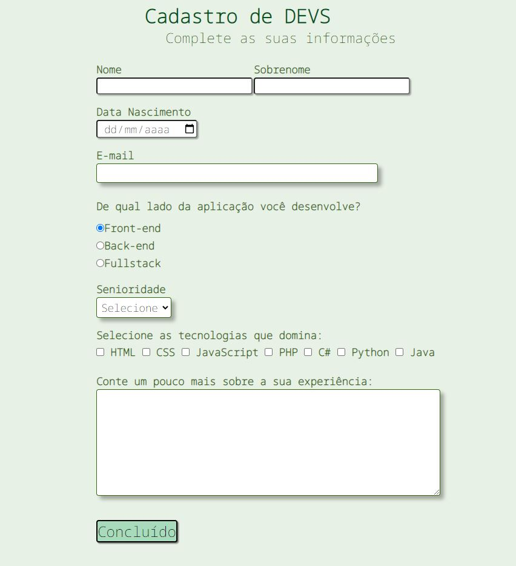

<h1 align="center"> Cadastro de DEVS </h1>

Projeto acadêmico 

  <a href="#tecnologias">Tecnologias</a>&nbsp;&nbsp;&nbsp;|&nbsp;&nbsp;&nbsp;
  <a href="#projeto">Projeto</a>&nbsp;&nbsp;&nbsp;|&nbsp;&nbsp;&nbsp;
  <a href="#layout">Layout</a>&nbsp;&nbsp;&nbsp;|&nbsp;&nbsp;&nbsp;

 

## 🚀 Tecnologias

Esse projeto foi desenvolvido com as seguintes tecnologias:

- HTML e CSS
- Git e Github

## 💻 Projeto

O 'Cadastro de DEVS' é um formulário para Desenvolvedores.

## 🔖 Layout

  

## 🔖 Link

https://jorge-saraiva.github.io/developerForm/